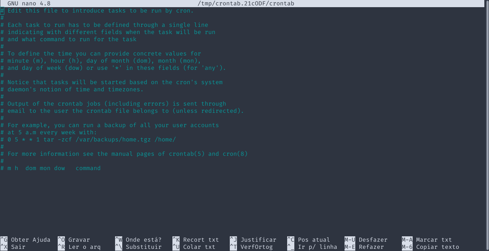

<h1 align="center"> atom-utils </h1>
<p align="center">
  
  <br><br>
  Esse repositório contém scripts úteis para manutenir o software livre
  AccessToMemory - AtoM (legacy ICA-AtoM).
</p>

---

<details>
<summary>Tutorial de download dos scripts (Linux) </summary>

### Instale o wget
```bash
sudo apt install wget
```

### Vá até a pasta desejada
```bash
cd /tmp # Pode ser qualquer pasta
```

### Baixe o arquivo desejado
```bash
wget https://raw.githubusercontent.com/docs-digitais/atom-utils/main/scripts/<NOME_DO_ARQUIVO>.sh
```

## Caso deseje mais de um script, você pode clonar o repositório:

### Instale o git
```bash
sudo apt install git
```

### Clone o repositório
```bash
git clone https://github.com/docs-digitais/atom-utils.git
```

</details>

---

## Script de Sanitização
> Arquivo: `scripts/sanitize.sh`
> 
> Versão do AtoM: `>= 2.7 < 2.8`

Este script foi desenvolvido com o intuito de sanitizar uma instância do AtoM.
Incluímos comandos para: reindexação, _regerar derivadas de acesso*_, reindexar
PDFs, limpar o cache, reiniciar serviços, etc...

> (*) O comando de re-geração de derivadas de acesso foi desativado com um
> comentário por inviabilizar o uso de alguns servidores mais modestos.

Atenção: o script deve ser executado como superusuário (sudo):
```sh
sudo sh /caminho/ate/o/script/sanitize.sh
```

Recomendamos que a sanitização seja feita fora de horários de grande demanda,
às `03:00am` por exemplo.

---

Os scripts podem ser usados pelo [Crontab](https://pt.wikipedia.org/wiki/Crontab)
para sanitizar seu AtoM sistematicamente.


> *Ao selecionar o horário, verifique o fuso horário do seu servidor para que
> não hajam confusões sobre o horário de execução do script.*

<details>
<summary> Tutorial simples</summary>

### Logar como root
```bash
sudo su
```
### Editar o crontab
```bash
crontab -e
```
Caso seja a sua primeira vez usando o cron, será requisitado que selecione um
editor de texto. Recomendamos o `nano`.

```bash
Select an editor.  To change later, run 'select-editor'.
  1. /bin/nano        <---- easiest
  2. /usr/bin/vim.tiny
  3. /usr/bin/code
  4. /bin/ed
```

Uma tela parecida com a abaixo vai ser aberta:



Você pode ignorar tudo o que está escrito e ir até o fim do arquivo.
Digite o formato do horário desejado, o exemplo a seguir executa o script
`às 3h da manhã de Domingo`:

```
0 3 * * 7 sudo sh <caminho/completo/até/o/arquivo/sanitize.sh>
```

> Caso seu script esteja na pasta `/tmp`, a linha do cron vai ficar assim: 
> ```
> 0 3 * * 7 sudo sh /tmp/sanitize.sh
> ```
>
> O [Crontab Guru](https://crontab.guru/) pode te ajudar a customizar o horário
em que o script será executado pelo CRON.

*Para executar um script TODOS os dias da semana às 3h da manhã: `0 3 * * *`*

Pressione `CTRL + S` para salvar e `CTRL + X` para sair, o cron será instalado
automaticamente.
</details>
